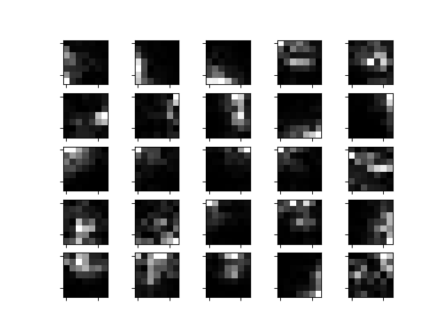

# nonnegative_convolutional_factorization
Non-negative Convolutional Factorization (a more specific case of NMF).

This is a more specific case of Nonnegative Matrix Factorization.

Now we have L filters {w_l}, and we want to minimize:

E(x,y) = sum_t x_t * log(x_t/y_t) - x_t + y_t

where y = sum_{l=1}^L conv(h_l,w_l,'full').

Like in NMF, this minimization is done first on {h_l}, the base images, and then on {w_l}.

So, for a single image the multiplicative rules are:

h_l^{t+1} = h_l^t * corr(x,w_l^t,'valid') / corr(y^t,w_l^t,'valid')

y^{t+1/2} = sum_{l=1}^L conv(h_l^{t+1},w_l^{t},'full')

w_l^{t+1} = w_l^t * corr(x,h_l^{t+1},'valid') / corr(y^{t+1/2},h_l^{t+1},'valid')

Some w's trained on 200 images from a set of images from Sam Roweis's site.

An example of h's given by these w's for an image:

And the partial sums:

